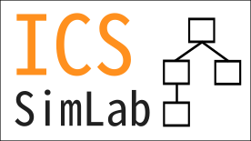

# ICS-SimLab

**Second development of the ICS simulation program. Designed to simulate general ICS and SCADA systems through a configurable and flexible system.**

## Quickstart
Run `sudo ./start.sh <configuration>` to start the simulation, where `<configuration>` is a directory for a configured simulation.

Pre-configured simulations are found in */config/\**.

E.g. to run a water bottle filling facility simulation, run `sudo ./start.sh config/water_bottle_factory`.

## Documentation
- Refer to [init.md](docs/init.md) to start a preconfigured simulation.
- Refer to [architecture.md](docs/architecture.md) to understand the architecture of the simulation.
- Refer to [configure.md](docs/configure.md) to learn to configure a custom SCADA simulation.