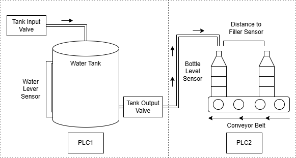
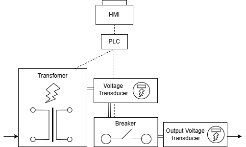

# Initialisation

## Configuration Directory
ICS-Sim uses a directory containing configuration information to build a custom ICS simulation. The directory needs to contain the following:

1. `configuration.json` - This is a JSON file containing the configuration for all components and networks (both serial ports and IP/TCP networks), as well as details on how the components talk to each other. For full details on how to create your own configuration, refer to the [configuration documentation](configure.md).

2. `logic/` - This is a directory that holds Python files to implement the logic for components that require custom logic (PLCs and HILs). For information on how these work again refer to the [configuration documentation](configure.md).

The name of the configuration file must be `configuration.json` and the name of the logic directory must be `logic`, but the Python files within the logic directory can be named whatever (the Python file names are referenced in the JSON config file).

## Predefined Simulations
This repository has a 3 pre-defined simulation configurations. They are located within `/config/` at the root of this repository. They are:

1. `smart_grid` - This simulation models a solar panel system that can switch between solar and mains power. The PLC decides which source to use based on how much solar power is being generated. Data from all components is displayed on the HMI.
    - HMIs:
        1. hmi - Displays all data from the sensors and actuators.
    - PLCs: 
        2. ats_plc - Controls the transfer switch based on solar generation levels.
    - Sensors:
        1. solar_power_power_meter - Records power generated by the solar panels .
        2. household_power_meter - Records total power currently available to the household.
    - Actuators: 
        1. transfer_switch - Switches between mains and solar power.
    - HILs:
        2. electrical_hil - Emulates solar power generation.

    

2. `water_bottle_factory` - This simulation has been adapated from [Dehlaghi-Ghadim et al., 2023] and models a water bottle filling facility. It uses two PLCs. The first controls a water tank with a level sensor and two valve actuators, an input valve and output valve, which maintains set water levels. The second PLC operates a conveyor belt that moves empty water bottles underneath the output valve of the water tank. It signals when bottles are ready for filling. A HIL module simulates all the physical processes.
    - HMIs:
        1. hmi1 - Displays all data from the sensors and actuators.
    - PLCs:
        1. plc1 - Control the water tank, which involves monitoring the water level and controlling when to open the tank input valve and output valve.
        2. plc2 - Controls the conveyor belt, which involves moving empty water bottles underneath the output water valve and signalling to plc1 when to open the output valve.
    - Sensors:
        1. tank_level_sensor - Measures the water tank level.
        2. bottle_level_sensor - Measure the water level of the current bottle being filled up.
        3. bottle_distance_to_filler_sensor - Measures the distance from the next empty water bottle on the conveyor to underneath the output water valve.
    - Actuators:
        1. tank_input_valve - Controls the input water tank valve.
        2. tank_output_valve - Controls the output water tank valve. This leads to the conveyor belt of empty bottles to fill them up.
        3. conyeor_belt_engine - Controls the conveyor belt.
    - HILs:
        1. bottle_factory - Controls all physical values for the water bottle filling factory.

    

3. `intelligent_electronic_device` - This simulation, inspired by Boakye-Boateng et al. (2023), models an Intelligent Electronic Device (IED) in a virtualized electrical substation. A HIL module simulates a transformer whose output voltage is monitored by sensors. Tap changer actuators adjust voltage at random intervals, either autonomously or via an HMI. If voltage readings fall outside the acceptable range, the PLC triggers a breaker actuator until stability is restored.
    - PLCs:
        1. ied - Controls the tap changes to adjust output voltage. Sets of a random tap change at random intervals.
    - Sensors:
        1. transformer_voltage_transducer - Measures voltage output after the transformer.
        2. output_voltage_transducer - Measures voltage output after the breaker.
    - Actuators:
        1. transformer - Performs tap changes to alter an input voltage.
        2. breaker - Controls whether output power can flow or not.
    - HILs:
        1. hil - Controls all environmental (physical) values of the system.

    

---
### References
A. Dehlaghi-Ghadim, A. Balador, M. H. Moghadam, H. Hansson, and
M. Conti, “Icssim—a framework for building industrial control systems
security testbeds,” Computers in Industry, vol. 148, p. 103906, 2023.

K. Boakye-Boateng, A. A. Ghorbani, and A. H. Lashkari, “Securing
substations with trust, risk posture, and multi-agent systems: A com-
prehensive approach,” in 2023 20th Annual International Conference on
Privacy, Security and Trust (PST), pp. 1–12, IEEE, 2023.